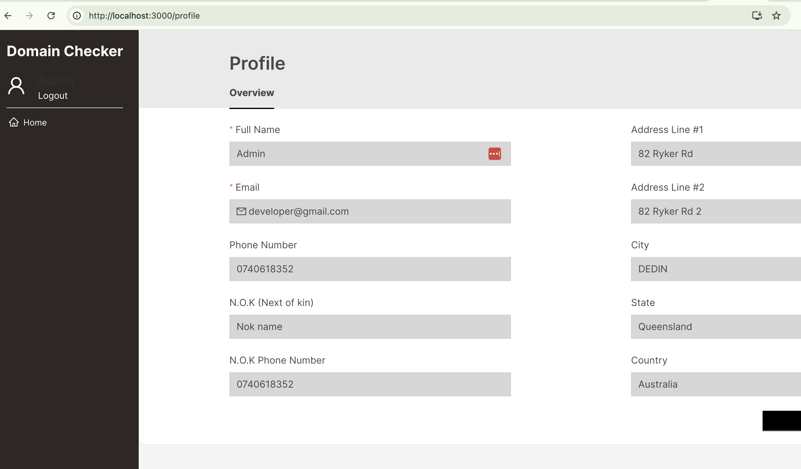
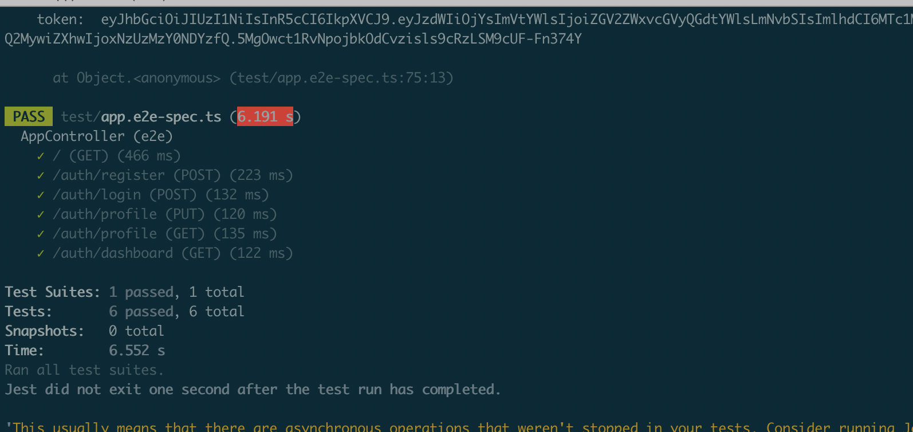

# dashboard-app
Donwnload source from repository
https://github.com/Huu-Thai/dashboard-app.git

Create database
cd dashboard-app/backend

copy .env from env.dist and change own environment variables

npm run typeorm migration:generate ./src/database/migrations/UserTable

npm run migrate

Running The Application

Start application:
docker-compose up --build

Access the frontend at: http://localhost:3000

Run E2E test
